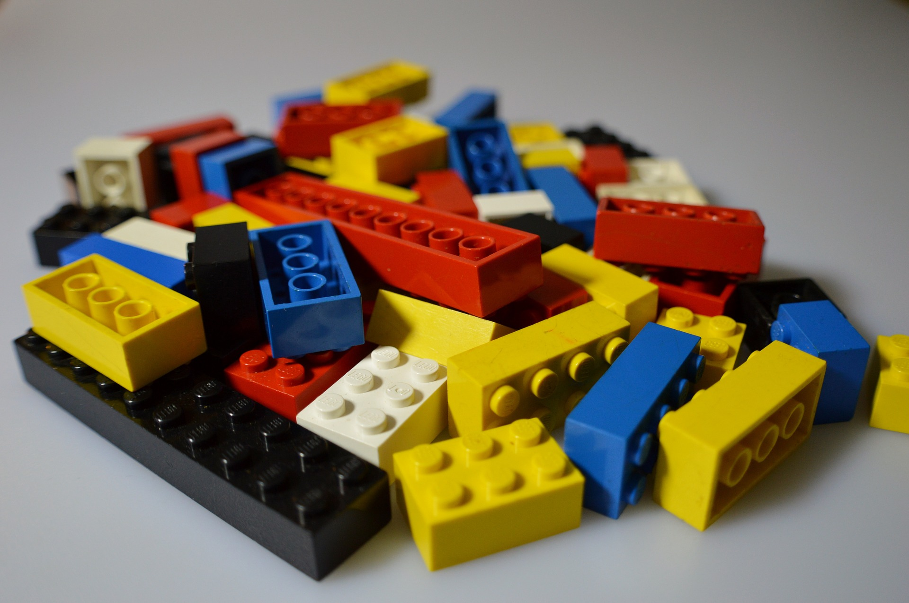

In [Chapter 4](/datatypes.html) we talked about some of the different ways that data can be interpreted and how Python deals with these different data types. In this chapter we'll take a larger view and focus on the organization of all our different data types. 

Usually data scientists are **not** producers of raw data but instead are the **consumers** of it. Because of this, we are very dependent on who's creating the data for us and the format that the data is in.  

Lucky for us, there has been standards for a while now on how to properly organize different data types. One extremely common data structure is **tables**, where data is organized into **rows** and **columns**.

### Rows and Columns 

In order to really understand data that's structured in tables, it's a good idea to look at some real data. Throughout this textbook we'll keep introducing datasets to bring some applicability to the concepts and tools that we learn. 

The first dataset we're going to look at is a fun one, it's data describing LEGOs! 

LEGO is a popular brand of toy building bricks with an enthusiastic fan base of all ages. LEGOs are sold in sets with each set containing a number of parts in different shapes, sizes and colors. The data below is a sample of a larger dataset that describes every single official LEGO set sold up to June 2017. 

| name                                                       | year | num_parts |
| ---------------------------------------------------------- | ---- | --------- |
| Weetabix Castle                                            | 1970 | 471       |
| Town Mini-Figures                                          | 1978 | 12        |
| Castle 2 for 1 Bonus Offer                                 | 1987 | 2         |
| Weetabix Promotional House 1                               | 1976 | 147       |
| Wild West Limited Edition Gift Pack                        | 1996 | 3         |
| LEGO Store Grand Opening Exclusive Set, Wiesbaden, Germany | 2010 | 146       |

LEGO's data is split into **rows** and **columns**. Each **row** of the data represents one offical lego set. Each **column** describes an **attribute** of a specific LEGO set in that row. 

There are three **columns** in the dataset: 

* `name` describes the name of each set and is of type `str`
* `year` describes the year that the set was  published and is of type `int`
* `num_parts` describes the number of parts for each set and is of type `int`

### Describing the Data (Data Dictionaries)

It might interesting why we described in such detail the LEGO set data. Isn't it possible to tell just from looking at the table what the the data is all about? 

Unfortunately, not always. While this dataset is pretty straightforward sometimes the data you receive might not be so obvious. 

The act of describing and understanding the data you recieve is an important part of the data science process and has a term associated with it: building a **data dictionary**. A formal definition for a data dictonary is as follows: 

> A **data dictionary** is a “centralized repository of information about data such as meaning, relationships to other data, origin, usage, and format". 

If you are recieving data, the legwork of describing the data should be outside of your hands. Regardless it's good practice to re-define/clarify the data you are receiving since it can be pivotal in the type of analysis you can do.

For any data provided in DataOne we will make sure to provide a data dictionary. This definitely won't be the last time you will encounter it! 

