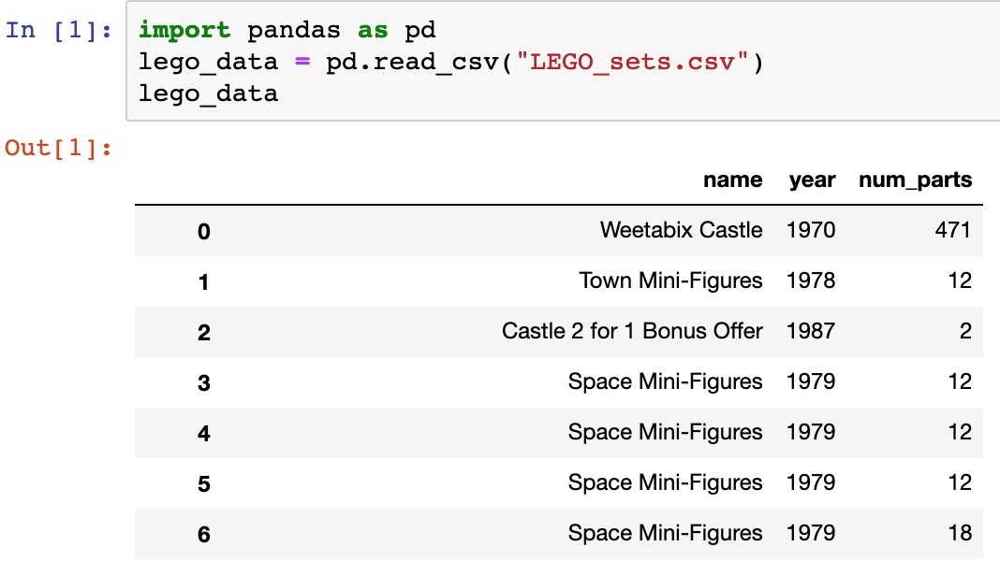

An assumption that this class makes is that the data we deal with will be in a Table-like format (consisting of rows and columns). This is not a wild assumption, working with table-like data is an established norm in the world of data science. 

In order to read in tables we use an external module in Python called `pandas`. **Pandas** is an extremely powerful tool that not just reads in data, but also helps with tasks such as data aggregation, cleaning, and filtering. We'll be exploring all these features of `pandas` as we progress through the course. 

Let's use `pandas` to read in the LEGO set dataset that we introduced from earlier! First, we need to make sure Jupyer can find our notebook in its virtual enviroment by uploading our dataset into Jupyter. 

***SCREENSHOT**

{}

The specific file format of this dataset is called Comma-Seperated-Values (or `.csv`). Each row in a `.csv` is stored as a seperate line and each column is seperated by a column. 

{}

Like any other external module, we will use an import statement to bring in `pandas` to our Jupyter notebook.

 ~~~python
import pandas as pd
lego_data = pd.read_csv("LEGO_sets.csv")
 ~~~

The first line of our import statment includes an **alias**, `pandas as pd` An alias is just a way of shortening a module name so its (slightly) easier to type later when using it throughout a computer program. Using `pd` as an **alias** for `pandas`  is very common and we will be using it from now on when we use`pandas`. 

### Displaying the Data 

Now that we've imported the LEGO set data into Jupyter, what does it look like? This is how the data displays in Jupyter. 

{}

One thing to notice in `pandas` and can be clearly seen in Jupyter is an extra column to the left of **[name, year, num_parts]**. This column is called the **index** and is automatically assigned to every table read into `pandas`. The **index** acts as a unique identifier for every row in the pandas table and allows for the selection of specific rows from the table just by the index itself. 

{}

The image above is actually cut off because the LEGO dataset is pretty large. (There's 11,673 rows!) It also unfortunately takes up quite a bit of the Jupyter notebook as Jupyter tries its best to display as much as it can. 

We can show just a certain number of rows however by using the `head` method.

~~~python
lego_data.head(5)
~~~

| name                       | year | num\_parts |
| -------------------------- | ---- | ---------- |
| Weetabix Castle            | 1970 | 471        |
| Town Mini-Figures          | 1978 | 12         |
| Castle 2 for 1 Bonus Offer | 1987 | 2          |
| Space Mini-Figures         | 1979 | 12         |
| Space Mini-Figures         | 1979 | 12         |

When we use the `head` method to display this new table, it creates a brand new table. (If we wanted to use this table later we would need to use an assignment statement to assign the table into a variable.) 

The `int` we feed into the `head` method tells us how many rows we want to display (starting from the top of the table). If we want to start to display rows from the bottom of the table we can use the `tail` method instead. 

~~~python
lego_data.read_csv("LEGO_sets.csv").tail(5)
~~~

| name                                                         | year | num\_parts |
| ------------------------------------------------------------ | ---- | ---------- |
| LEGO Store Grand Opening Exclusive Set, Mayfair, Wauwatosa, WI | 2012 | 15         |
| Micro White House                                            | 2015 | 59         |
| LEGO Store Grand Opening Exclusive Set, Wiesbaden, Germany   | 2010 | 146        |
| Wishing Well [Toys R Us Promo]                               | 2013 | 28         |
| Wild West Limited Edition Gift Pack                          | 1996 | 3          |

Finally if we just want to see a random sample of rows in our data set we can use the `sample` method. 

~~~python
lego_data.read_csv("LEGO_sets.csv").sample(5)
~~~

**name**|**year**|**num\_parts**
-----|-----|-----
Basic Building Set in Cardboard|1965|57
Train Level Crossing|2003|326
Imperial Flagship|2010|1623
Sopwith Camel|2012|877
My First Police Set|2014|39

{}

Tables that are read into `pandas` are called **dataframes**. Its also common to see `df` as a variable name for a variable that stores a `pandas`  **dataframe**. 

{}

In the next lesson we'll continue our journey through `pandas` and learn some tools to manipulate our data tables! 

