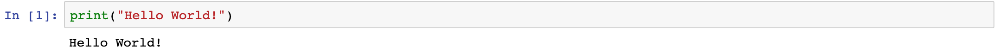

Python is the **computer programming language** this class is taught in. Similar to other human languages like English or Russian, understanding the grammar of Python is absolutely critical before really knowing how to "speak" it.  By using a combination of Jupyter, (our platform for data science), and Python (our programming language), we will be able to build computer programs. 

What's the best way to learn Python? The answer is simple: **Practice**. Attending lecture and reading this textbook can help but without practicing the language there's no realistic way to get  better. 

Learning Python isn't going to be a piece of cake but is definitely worth the effort. Python has quickly become a preferred programming language for doing data science and recently became the 3rd most popular programming language in the world! 

{} 

The class assumes that work is done within a Jupyer Notebook and is leveraging Python Version 3 (Python3). While most if not all the material can be modified to run using older versions of Python and outside of Jupyter itself, we strongly reccomend sticking with these tools to have the best instructional experience!

{}

### Hello World in Python

Let's write a Python program that can print out messages, mainly one that can print "Hello World!". (This is a common first program to write when learning a new programming language). The way to do this in Python is as follows: 

~~~~python
print("Hello World!")
~~~~

If we run this programming statement in Jupyter, we we will see an outpult like below. 

Here **print** acts as a *function* that prints out the statement that we want to be printed. The printed cell statement gets displayed in Jupyer, right below the cell itself. (We'll learn more about *functions* very soon in Chapter X.) 

Feel free to copy this exact programming statement above, (by using the handy "copy to clipboard" button at the right of the black programming statement), into a Jupyter notebook to confirm that the **print** function works.  Changing what's in the quotes will lead to different statements being printed out. Pretty neat right? 

We already wrote our first program and did so in just **one** programming statement! In the next lesson we'll dive more into programming statements by learning about two different flavors of them, *Expressions* and *Assignments*.  