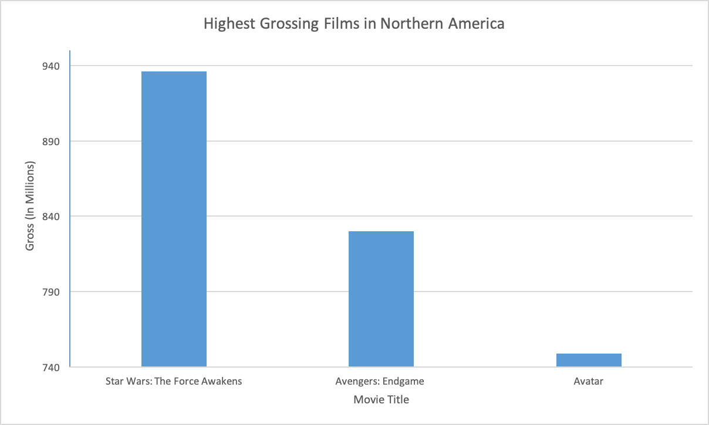
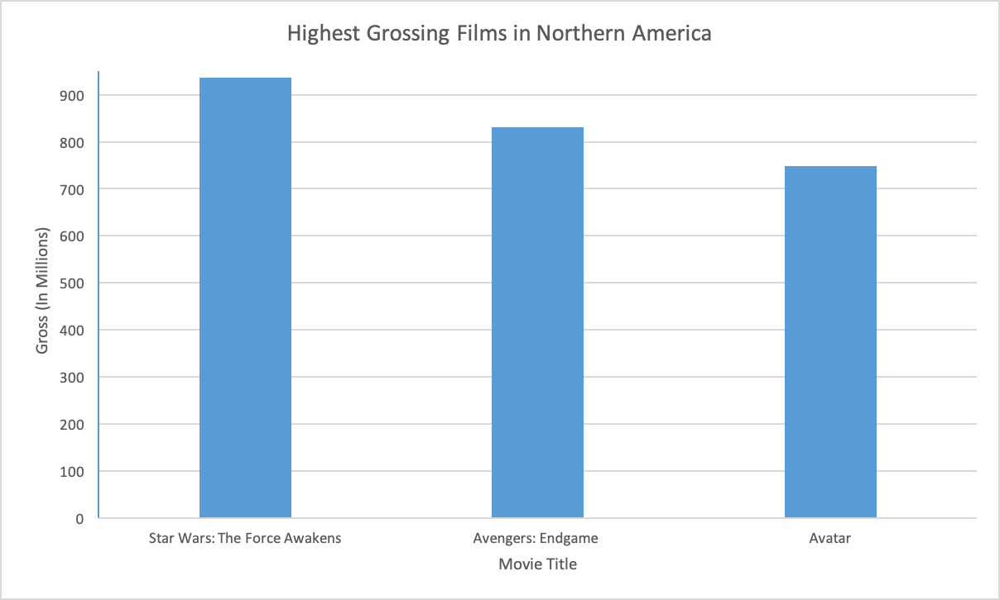
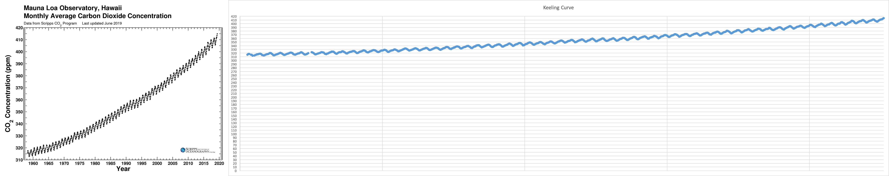
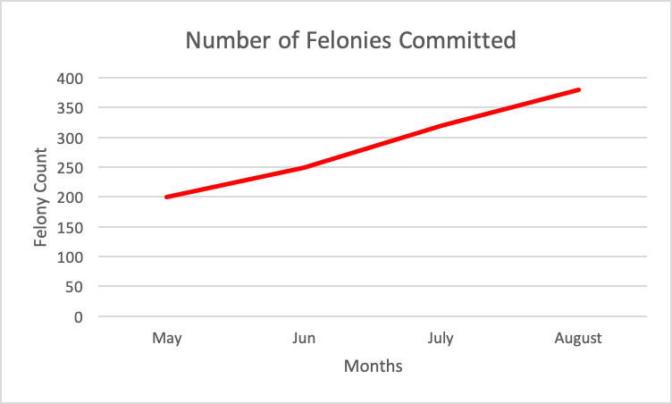
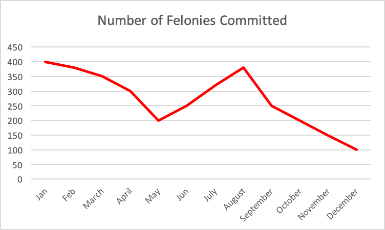
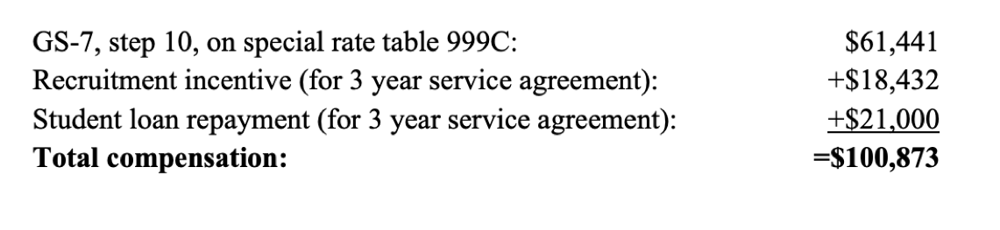
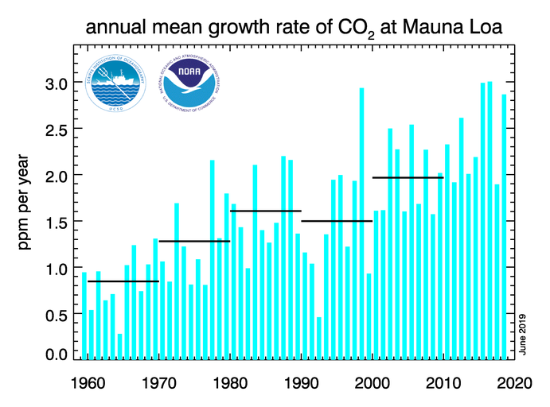

>  *There are three kinds of lies: lies, damned lies, and statistics* ~ Mark Twain

Mark Twain might have been a tad too harsh with his evaluation of one of the core tenets of data science, but there is a certain level of truth to what he said. Statistics can become extremely misleading, especially when used to bolster weak arguments. 

In this lesson we'll talk about some common ways that statistics can be used to mislead (usually unintentionally but sometimes even intentionally! )  

### Accuracy vs. Precision

Let's pretend we were reading two reports, both containing statistics on the African Cheetah, nature's fastest land animal. Report #1 described the weight of an average cheetah as being "above" 100 lbs while report #2 described the average weight be approximately 152.4 lbs. Which report should we trust? 

We might lean towards report #2 but doing so would be committing a common fallacy when analyzing numbers, mistaking **accuracy** with **precision**. 

The truth is that there is quite a bit of variability on the weight of adult cheetahs. (They can range from weighing 83 lbs all the way to 145 lbs.) Claiming that the average cheetah weighs 152.4 pounds would be very **precise** but wouldn't be very **accurate** since it's completely out of the observed weight range. In this case, Report #1 is actually more accurate because most cheetahs are in fact above 100 lbs. 

We obviously want statistics that are both accurate and precise, but it's a common mistake to automatically assume accuracy out of precise measurements. 

### Units of Measurement 

> "Our economy is doing terrible, thirty states have lost jobs in the past year!" ~ Politician A

> "Our economy is doing fantastic, we've had positive job growth across the country!" ~ Politician B

Who's correct here? Well technically both politicians are.  

Looking at the state level, it can be correct to make the argument that the economy is doing poorly based on the lack of job growth at the state level. The **unit used to measure** job growth is individual state economies. 

Meanwhile it can also be accurate to argue that the economy is doing well if the **unit of measurement** we use is at the national level. States with larger populations such as New York may be having stronger job growth while other less populated states, such as North Dakota and Montana, may be loosing employment. 

### Misleading Visualizations

When data gets visualized it should **always** be looked at with a critical eye. Below are specific examples of visualizations that tell different stories an lead to drawing faulty conclusions about data. 

>  **Changing the vertical axis' starting point**

Below is a bar graph comparing the three highest grossing films in North America (as of 2019). 

Seems like *Star Wars: The Force Awakens* crushed *Avatar*! 

Not so fast. Looking at the *vertical axis*, (the vertical line of the graph), you'll notice that this graph actually starts at $740 million dollars. What happens if we start from 0 instead? 

Big difference! Does that mean that every single y-axis should start at zero? 

Not necessarily. As a counter example, below are two graphs of the *Keeling Curve*, a graph of the accumulation of carbon dioxide in the Earth's atmosphere from 1958 to the present day. The data that is graphed is identical and comes from Mauna Loa Observatory on the island of Hawaii 

Both datasets show a **signficant** increase in the amount of carbon dioxide in the atmosphere.[^1] But deciding to include zero in the 2nd graph might actually prevent the display of any sort of significant trend in the data. 

> **Selectively Selecting Data**

Below is a graph of felonies committed in a fictional city over a period of time in 2018. 

Just from this graph, it might be reasonable to conclude that crime is going up in this particular city. However only a couple months are shown in this graph, specifically summer months. 

Graphing the entire year paints a completely different picture.

Compared to the start of the calendar year in January, crime has actually gone down 75%! 

Selectively selecting data isn't just a problem for visualizations, it can affect all sorts of analysis on data. Be extra cautious when looking at any sort of time driven data, especially when extrapolating towards future predictions. 

Data scientists will see (and generate) plenty of visualizations but the most important takeaway here: There is **no such thing as an objective visualization**. It's good practice to assume some sort of agenda behind anything you see. 

### Misleading Numbers 

The final category of "deception" we'll talk about is when numbers are used to boltster argumentation. 

Numbers are fantastic, they offer quantifiable evidence of natural occuring phenomena. Never accept number (or any other piece of quantifiable data) at face value though, once again a critical eye is absolutely necessary. 

To highlight, let's talk about one of our favorite topics/concerns at work, recruiting and retaining talent! 

On Nov 29th, 2016, the Office of Personnel Management (OPM) released a guide/study discussing this exact topic titled *Compensation Flexibilities to Recruit and Retain Cybersecurity Professionals*. In it OPM hoped to highlight compensation actions to meet the ever growing need for talented cybersecurity workforce to address complex and ever-evolving cyber threats. 

The OPM proposed a strategy where the federal government could match competitive compensations for a wide vareity of career stages. Below is OPM's analysis on one particular compensation recruitment problem and a strategy proposed to solve it.

**Recruitment Problem**: An agency wants to hire a student who is graduating with a degree in cybersecurity for a Information Security position in Washington, DC. Unfortunately the student already has a locally competitive offer of $95,000.

OPM's Solution: 

1. The agency establishes a base pay at GS-7, step 10, on special rate at ($61,441) based on the competing job offer.   
2. The agency then offers a recruitment incentive of 10 percent with a **three-year service agreement.** 
3. The agency also offers to repay the candidate’s student loan of $21,000. 

100,873 is definitely bigger than ​95,000. Did the federal government actually beat this offer? 

The math here is *technically* correct, but it's missing extremely important context. 

First we need to analyze and breakdown three years that this hypothetical student will be employed, not just the 1st year "advantage": 

We also have to analyze the amount of money this student would earn at the competing location. 

The locally competive offer beats the federal government by **61,245** over the three years. (And it also doesn't include a three year service agreement.) [^2]

[^1]: Want more convincing evidence? Below is a graph that shows the growth rate in carbon dioxide in the atmosophere over the past 70 years. Using percentage change instead of raw numbers in a graph can be a way to standardize potentially unfamiliar measurements. 
[^2]: The screenshot with their math is straight from their report! And its still avalible on their website! 