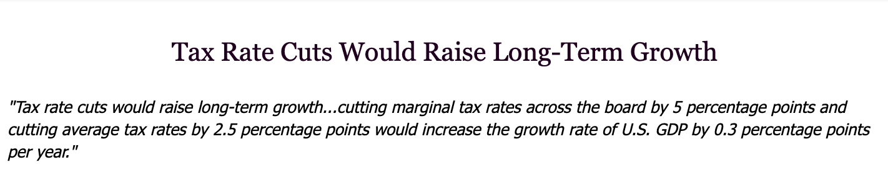

Is drinking red wine good for you? Is reducing taxes a good way to spur the economy? What actually causes liver cancer? Some of the most fundamental questions we ask attempt to attribute a reason to an outcome.  (ie. a **cause to an effect**.) By carefully examining data and applying data science principles we can start to find answers to some of these **cause and effect** questions. 

Let's look at some reports that claim to have answers to these cause and effect questions. In early 2019, University of Michigan's Health Lab published an article summarizing an experimental study they had conducted with the following headline: **Moderate Alcohol Intake Associated with Less Chronic Pain, Depression.** 

In another report, the National Bureau of Economic Reserach (NBER) summarized a recent study that it had done and claimed that based on historical trends regarding tax rates and economic growth, future tax rate cuts would raise long-term growth. 

How are researchers able to make these type of conclusions? By carefully observing the data, finding associations within the data, and drawing appropriate conclusions. 

### Observational Studies 

The past two studies were **observational studies**. An **observational study** is one in which scientists make conclusions based on data that they have observed but had no hand in generating. 

In both the Michigan and NBER study, scientists didn't actually create the data that they used to draw their conclusions. To clarify, Michigan researchers didn't force anyone to drink alcohol, (because that would be unethical). Similarily, NBER researchers have absolutely no control over the national tax rate, they instead observed data in the past and used it to fuel future predictions. 

The components of an observational studies can be broken down into three groups: 

* The **population** that's being observed
* The **treatment** that's being applied 
* the **outcome** of the study 

For Michigan's Alcohol study the **population** was the human beings they gathered data on, the **treatment** was the amount of alcohol that was being consumed, and the **outcome** was the reported symptoms by the people observed in the study. 

The practice of observing data is very common in data science, *very rarely* are data scientists the ones actively creating the data that they are doing data science on. 

### Asking Questions

When observing data, there's two "levels" of questioning that should be asked when attributing a cause to an effect: 

1. Is there a **relationship** (**correlation**) between the treatment and the outcome?
2. Did the treatment **cause** the outcome? 

{}

A **correlation** is a term used in statistics to describe a relationship between two or more things, here between a treatment and an outcome.

{}

Let's take these levels of questioning and apply it to the University of Michigan's study. The quote below from the academic paper summarizes the conclusions of the study 

> Moderate alcohol users reported significantly lower FM symptoms (widespread pain and symptom severity), pain severity, interference, anxiety, depression, and catastrophizing, and they reported higher physical function. 

First, is there a **relationship** between moderate alcohol consumption and lower Fibromyalgia symptoms? According to the summary statement given above, yes it does seem like there is probably some sort of relationship. 

Second, does alcohol consumption **cause** a reduction in Fibromyalgia symptoms? This is a actually a much harder question to answer, even with all the research done by The University of Michigan.  

Proving a cause and an effect, that a treatment directly causes an outcome, can be very difficult, particulary with observational studies. This is due to the presence of **confounding variables**.

### Confounding variables

To best demonstrate the impact of **confounding variables** we'll bring up a topic that's near and dear to any high schooler (or their parents') hearts, improving SAT scores. 

{}

The SAT or the Scholastic Aptitude Test, is a standardized exam made up of of three sections: math, reading, and writing. 

{}

Looking at data of household families and their child's SAT scores, there actually is a strong positive **correlation** between the amount of televisions a family has and the SAT score of the children in that family. Does that mean that parents should try buying more TVs to bosts their child's test score? 

No, unsuprisingly having 5 TVs doesn't mean you'll get a 1600 on the SAT. While there is indeed a strong positive correlation between TVs and SAT scores, what's actually causing high SAT scores is the household income of the family. Wealthy families tend to score better on the SATs because their kids tend to go to better schools and have access to better resources. 

The wealth of families acts as a **confounding** variable here, being the real treatment that drives an observed outcome.  

It would also be incorrect to claim with 100% confidence that it's alcohol conumption that's driving lower pain symptoms. The type of person who drinks a glass of red wine every day may also be someone who has more time to actively relax (and pour out that cup of red wine), which could possibly be the confounding variable driving our outcome.  

A very common phrase that statisticians use to emphasis what we just demonstrated: **Correlation does not imply causation!**

### Proving Causality

Is it possible to prove causality and avoid confouding variables? Through careful experimental design and randomization, yes we can. 

For example, lets design a brand new study of SAT test takers to truly see if TVs are causing high SAT scores. 

Step 1: Out of all the students in the United States who are intending to take the SAT, randomly assign half of them into a treament group and a control group. 

Step 2: Give the treatment group a television set, and give the control group nothing. 

Step 3: Wait and measure SAT scores after the introduction of TVs into a household. 

What we just described is called a **randomized controlled experiment**, also known as a **randomized controlled trial (RCT)**. This approach avoids the problem of confouding variables because both wealthy and non wealthy families are getting televisions. If it is really TVs causing high SAT scores, we should see a jump in scores with everybody in the treatment group. 

Unfortunately it can be rare to work with data as a data scientsts that's been generated purely due to randomization. Thus be careful to watch out for confounding variables when attributing a cause to an effect, especially in observed data!

