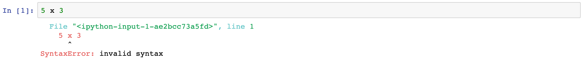
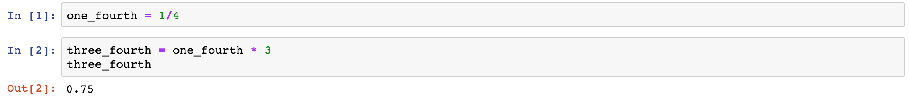

Computer programs are made of **expression statements** and **assignment statements**. We use **expressions statements** to either combine pieces of data or to call programming functions. We use **assignments statements** to store information for later use. 

### Expression Statements

A very common task that we can use expression statements for is to combine numbers to do math. For example, if we wanted to mulitply the number `5` and the number `2`, we can use a Python expression as follows: 

~~~python
5 * 2
~~~

Here the mathematical operator `*` tells Python to multiply the number on the left `5` with the number on the right `2`. Just like the English language, Python reads and evaluates left to right and ultimately returns the ouput of the expression which is `10`. 

While programming languages have strong similarities to human languages, one big difference is that computers **can not interpret context**. Unlike human vernacular you can not be "close enough" when you  write Python for the computer to understand what you are trying to tell it to do. Let's see what happens if we try to multiple 5 and 2 using another common operator for mulitplication `x`. 

Python returns an error message saying that it cannot execute the expression statement that was written earlier.  Python only understands `*` to be mathematical operator associated with mulitplication and doesn't know how to interpret `x`. 

{}

Specifically you get a `SyntaxError` which is Python telling you **where** in the sequence of characters you typed that it stopped understanding what you were trying to tell it do. 

{}

{}

The takeaway here is that while computers are powerful they are still pretty naive and you absolutely need to be precise!  

{}

There are many different kinds of mathematical expressions you can write. The following table describes a set of mathematical operators that are absolutely essential to programming in Python.

| Expression Type | Operator | Example | Value  |
| :-------------- | :------- | :------ | :----- |
| Addition        | +        | 5 + 3   | 8      |
| Subtraction     | -        | 5 - 3   | 2      |
| Multiplication  | *        | 5 * 3   | 15     |
| Division        | /        | 5 / 3   | 1.6667 |
| Remainder       | %        | 5 % 3   | 2      |

### Assignment Statements

We use assignment statements to assign values to **variables**. In an assignment statement, a **variable** is followed by `=`, which is followed by any expression statement. 

~~~python
a = 4 * 3
~~~

Here the **variable **`a` has been assigned the **value** of the mathimatical expression `4 * 3` which is `12`. 

Once a variable has been assigned it may be used later in the program. 

~~~
a = 25 
b = 5 
a / b
~~~

~~~
5
~~~

In Jupyter this also means that we can assign a value to one variable in one Jupyer cell and it may be used later in another Jupyter cell. Python will remember this value for the rest of the Jupyter notebook. 

{}

If you want Jupyter to just show a variable value, you can type the name of the variable in the last line of a cell (like was done above).

{} 

In Python variable names must start with a letter in the alphabet but can contain both letters and numbers. Variable names also can't have a space within them, but if you wish to use a phrase to describe a variable it's a common practice in Python to seperate that phrase with underscores `_` (like the fraction example from above).

While you have quite a bit a freedom in naming variables, make sure to name them in ways that makes it easy to understand what you are trying to store. In the following example, care was taken to properly name the variables required to calculate the total amount saved for an order of wool jackets. 

~~~python
discount_off_total_order = 0.2 

sticker_cost_of_jacket = 125

amount_of_jackets_bought = 10

amount_saved = 125 * 10 * 0.2 

amount_saved
~~~

~~~Python
250
~~~

